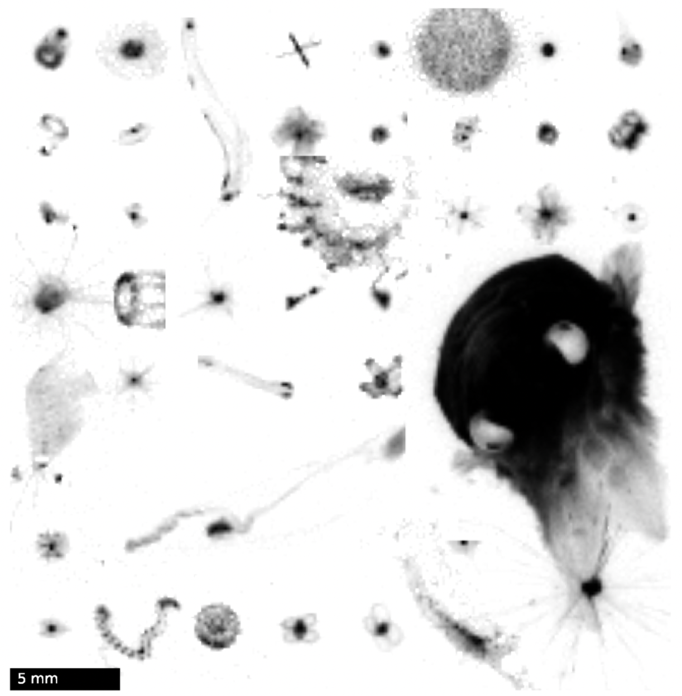

<head>
 <script src="https://cdn.mathjax.org/mathjax/latest/MathJax.js?config=TeX-AMS-MML_HTMLorMML" type="text/javascript"></script>
 <script type="text/x-mathjax-config">
 MathJax.Hub.Config({
 tex2jax: {
 skipTags: ['script', 'noscript', 'style', 'textarea', 'pre'],
 inlineMath: [['$','$']]
 }
 });
 </script>
</head>

## Global Reconstructions of Particle Size Distribution from UVP5 Observations Using Bagging Random Forest Algorithm

I applied machine learning techniques to investigate global particle size distributions (PSDs) data. Briefly, I reconstructed the BioVolume and Slope data by applying a bagged Random Forest (RF) algorithm to a global data set of UVP5 (Underwater Vision Profiler) observations. Below is my report.

***

## Introduction 

The export of sinking particles from the surface ocean plays a critical role in carbon sequestration and provides energy to the deep biosphere. Despite numerous studies estimating the magnitude and spatial patterns of this export through in situ particle flux observations, satellite-based algorithms, and ocean biogeochemical models, uncertainties persist.

In this study, I analyze global particle size distributions (PSDs) derived from a compilation of in situ Underwater Vision Profiler 5 (UVP5) optical measurements. Using machine learning techniques, I extrapolate sparse UVP5 observations to the global ocean using well-sampled oceanographic variables. Specifically, I reconstruct global maps of PSD parameters - biovolume (BV) and slope. These reconstructions reveal consistent global patterns, with high chlorophyll regions generally characterized by high BV and flatter slope, that is, indicating a greater relative abundance of larger particles compared to small ones.

The Random Forest (RF) algorithm used here is a supervised learning method that learns from labeled data to predict outcomes for unlabeled data. RF employs decision tree in an ensemble, training each tree on a bootstrapped subset of the data and averaging the results. This ensemble approach improves predictive performance, as it reduces the risk of overfitting and captures complex, non-linear relationships between variables. The model’s performance is validated using "out-of-bag" (OOB) data, i.e., data that is not used in training individual trees, ensuring the robustness of the reconstructions.

In this work, I employ a Bagging RF algorithm to extrapolate PSD BV and slope values to a global grid, using monthly climatological predictors such as temperature, salinity, silicate, depth, shortwave radiation, and various biogeochemical variables like oxygen, nutrients, chlorophyll, mixed layer depth, net primary production (NPP), euphotic depth, and iron deposition. These predictors help capture both static and dynamic aspects of PSDs, improving the accuracy and reliability of the reconstructions.

## Data

The original BV and Slope data used in this study were collected by UVP5 during various cruises between 2008 and 2020 as part of the EcoPart dataset. , where the data are collecting by UVP5 from different cruises. The dataset includes over 6,700 profiles from 119 cruises. UVP5 captures images of particles in a control volume as it is lowered through the water column, recording particle size distributions (PSDs) in multiple size bins.



*Figure 1: Images of plankton collected by UVP5 (Kiko and Schröder, 2020)*

PSD is modeled as:

$$ n(s) = n_0 \times s^{-\beta}$$

where s is the equivalent spherical diameter or particle size (in units of $\mu m$), and n(s) is the abundance of particles (units of $m^{-3} \mu m^{-1}$) in a vanishingly small size interval [s, s + ds]. $n_0$ is the intercepth and $\beta$ is the slope. So BV is given by:

$$ BV = \int_{s_{min}}^{s_{max}} n(s) \cdot \frac{\pi}{6} \cdot s^3 ds = \frac{\pi}{6} \cdot n_0 \cdot(\frac{s_{max}^{4-\beta}}{4-\beta} - \frac{s_{min}^{4-\beta}}{4-\beta}) $$

where we set $s_{min} = 105 \mu m$ to avoid a potential slight instrument bias in the lowest size classes; and $s_{max} = 5 mm$, which corresponds to the size where zooplankton start to dominate the BV at a variety of locations sampled by UVP5.

Therefore, with the Biovolume data and the slope data, we would be able to in return determine the intercept, thus allowing for detailed modeling of particle distributions, which is key for understanding the biogeochemical cycles in the ocean.

The PSDs data is binned on a regular 1° resolution global grid. Taking 100m depth (which is usually considered as a threshold for mixed layer or euphotic layer) as an example, the plots of seasonal mean of the original data are as follows: 


*Figure 2: Original BioVolume data. Values were preprocessed using log10, where -1 corresponds to a biovolume of 0.1 ppm, and 1 corresponds to a biovolume of 10 ppm.*


*Figure 3: Original Slope data (unitless).*

In this project, I use the RF algorithm to predict particle biovolume and slope based on a range of oceanographic predictors. The predictors are collected from various datasets based on the choice in Clements et al. (2022):

<table>
  <tr>
    <th>Feature Category</th>
    <th>Feature</th>
    <th>Dimensions</th>
    <th>Sources</th>
  </tr>
  <tr>
    <td>Universal</td>
    <td>Temperature</td>
    <td>12 × 102 × 180 × 360 </td>
    <td>WOA 18</td>
  </tr>
  <tr>
    <td> </td>
    <td>Salinity</td>
    <td>12 × 102 × 180 × 360 </td>
    <td>WOA 18</td>
  </tr>
  <tr>
    <td> </td>
    <td>Silicate</td>
    <td>12 × 102 × 180 × 360 </td>
    <td>WOA 18</td>
  </tr>
  <tr>
    <td> </td>
    <td>Depth</td>
    <td>12 × 102 × 180 × 360 </td>
    <td>WOA 18</td>
  </tr>
  <tr>
    <td> </td>
    <td>Shortwave Radiation</td>
    <td>12 × 180 × 360 </td>
    <td>ERA 5</td>
  </tr>
  <tr>
    <td>Oxygen</td>
    <td>Oxygen</td>
    <td>12 × 102 × 180 × 360 </td>
    <td>WOA 18</td>
  </tr>
  <tr>
    <td> </td>
    <td>AOU</td>
    <td>12 × 102 × 180 × 360 </td>
    <td>WOA 18</td>
  </tr>
  <tr>
    <td>Nutrients</td>
    <td>Nitrate</td>
    <td>12 × 102 × 180 × 360 </td>
    <td>WOA 18</td>
  </tr>
  <tr>
    <td> </td>
    <td>Phosphate</td>
    <td>12 × 102 × 180 × 360 </td>
    <td>WOA 18</td>
  </tr>
  <tr>
    <td>CHL</td>
    <td>Merged Chlorophyll</td>
    <td>12 × 180 × 360 </td>
    <td>GlobColour</td>
  </tr>
  <tr>
    <td> </td>
    <td>Modis Chlorophyll</td>
    <td>12 × 180 × 360 </td>
    <td>NASA G.S.F.C.</td>
  </tr>
  <tr>
    <td>MLD</td>
    <td>Mixed Layer Depth I</td>
    <td>12 × 180 × 360 </td>
    <td>MIMOC</td>
  </tr>
  <tr>
    <td> </td>
    <td>Mixed Layer Depth II</td>
    <td>12 × 180 × 360 </td>
    <td> de Boyer Montegut et al. (2004) </td>
  </tr>
  <tr>
    <td>NPP</td>
    <td>Eppley VGPM</td>
    <td>12 × 180 × 360 </td>
    <td>Antoine and Morel (1996) </td>
  </tr>
  <tr>
    <td> </td>
    <td>VGPM</td>
    <td>12 × 180 × 360 </td>
    <td>Behrenfeld and Falkowski (1997) </td>
  </tr>
  <tr>
    <td> </td>
    <td>CBPM</td>
    <td>12 × 180 × 360 </td>
    <td>Westberry et al. (2008) </td>
  </tr>
  <tr>
    <td> </td>
    <td>CAFE</td>
    <td>12 × 180 × 360 </td>
    <td>Silsbe et al. (2016) </td>
  </tr>
  <tr>
    <td>Euphotic Depth </td>
    <td>Eppley VGPM Euphotic depth</td>
    <td>12 × 180 × 360 </td>
    <td>Morel et al. (2007) </td>
  </tr>
  <tr>
    <td> </td>
    <td>VGPM Euphotic depth</td>
    <td>12 × 180 × 360 </td>
    <td>Morel et al. (2007) </td>
  </tr>
  <tr>
    <td>  </td>
    <td>CBPM Euphotic depth</td>
    <td>12 × 180 × 360 </td>
    <td>Morel et al. (2007) </td>
  </tr>
  <tr>
    <td>Iron Deposition </td>
    <td>ELabile Fraction</td>
    <td>12 × 180 × 360 </td>
    <td>Myriokefalitakis et al. (2018) </td>
  </tr>
  <tr>
    <td> </td>
    <td>Soluble Fraction</td>
    <td>12 × 180 × 360 </td>
    <td>Hamilton et al. (2019) </td>
  </tr>
</table>

For temperature, salinity, silicate, oxygen, and nutrients, we will also consider both their temporal and vertical changes as parts of predictors; for shortwave radiation, chlorophyll, NPP, mixed layer depth, euphotic depth, and iron deposition, which remain the same at different depth, just consider their temporal changes.

Full dataset please see: [Data](https://drive.google.com/file/d/175V6WS3_XfMfbhGWyWN2-m_0Ire3VIcR/view?usp=share_link).

## Modeling

The algorithm applied in this project is based on Bagging Random Forest Regression, which is a combination of the Random Forest (RF) ensemble learning method and the Bagging (Bootstrap Aggregating) technique.

RF is an ensemble of decision trees, where each tree is trained on a different random subset of the data, and predictions are made by averaging the predictions of all the tress. Then main idea is that combining multiple models (trees) improves generalization by reducing overfitting. Bagging is a technique where each tree is trained on a random subset of the data. These subsets are created by bootstrapping, i.e. sampling with replacement from the original dataset. Some data points are included multiple times, while others are left out. The key concept is that the data points left out in each subset can be used to estimate the model's generalization error, i.e. how well it might perform on unseen data.

One of the key features of Bagging RF is the ability to evaluate the model using in-bag and out-of-bag (OOB) predictions. In-bag predictions are predictions made on the same data points that were used to train each individual decision tree, i.e. the data points that were sampled in the bootstrapped subset. Each tree is trained on a different subset of the data, leaving out about one-third of the data. The data points that were left out in each bootstrapped sample are used to make OOB predictions, effectively serving as a validation set. This is especially useful for assessing model performance without needing a separate validation dataset.

For both the in-bag and out-of-bag predictions, the $$R^2$$ and RMSE metrics are calculated using the r2rmse() function.

Here is an excerpt of the code:

```python
from sklearn.ensemble import RandomForestRegressor

# RandomForestRegressor

model = RandomForestRegressor(random_state=0, oob_score=True)

pred_bv = []
pred_sp = []

preds = np.column_stack((predictors_ddepth.flatten(),
                         predictors_temp.flatten(),predictors_temp_ddd.flatten(),predictors_temp_ddt.flatten(),
                         predictors_salt.flatten(),predictors_salt_ddd.flatten(),predictors_salt_ddt.flatten(),
                         predictors_si.flatten(),predictors_si_ddd.flatten(),predictors_si_ddt.flatten(),
                         predictors_shwv.flatten(),predictors_shwv_ddt.flatten(),
                         predictors_oxy.flatten(),predictors_oxy_ddd.flatten(),predictors_oxy_ddt.flatten(),
                         predictors_nut.flatten(),predictors_nut_ddd.flatten(),predictors_nut_ddt.flatten(),
                         predictors_chl.flatten(),predictors_chl_ddt.flatten(),
                         predictors_npp.flatten(),predictors_npp_ddt.flatten(),
                         predictors_mld.flatten(),predictors_mld_ddt.flatten(),
                         predictors_irn.flatten(),predictors_irn_ddt.flatten(),
                         predictors_zeu.flatten(),predictors_zeu_ddt.flatten(),))

x = preds
X = preds
y = np.column_stack((biov_data.flatten(), slope_data.flatten()))

# Remove rows with NaN values
idrem = np.unique(np.concatenate([np.where(np.isnan(np.mean(y, axis=1)))[0], np.where(np.isnan(np.mean(x, axis=1)))[0]]))
x = np.delete(x, idrem, axis=0)
y = np.delete(y, idrem, axis=0)

model.fit(x, y)

yhat = model.predict(x)
y_oob = model.oob_prediction_

def r2rmse(y_pred, y_true):
    r2 = r2_score(y_true, y_pred)
    rmse = np.sqrt(mean_squared_error(y_true, y_pred))
    return {'r2': r2, 'rmse': rmse}

mask = np.mean(X, axis=1)
mask[~np.isnan(mask)] = 1
mask[np.isnan(mask)] = 0

X[np.isnan(X)] = 0
y_recon = model.predict(X)
y_recon = y_recon * mask[:, np.newaxis]

# Calculate R2 and RMSE for both biological variable and slope predictions
pred_bv.append({
    'oobPred_bv': y_oob[:, 0],
    'inBagPred_bv': yhat[:, 0],
    'keep_data_bv': y[:, 0],
    'oobStats': r2rmse(y_oob[:, 0], y[:, 0]),
    'inBagStats': r2rmse(yhat[:, 0], y[:, 0]),
    'recon':y_recon[:, 0].reshape(12,102,180,360)
})

pred_sp.append({
    'oobPred': y_oob[:, 1],
    'inBagPred': yhat[:, 1],
    'keep_data': y[:, 1],
    'oobStats': r2rmse(y_oob[:, 1], y[:, 1]),
    'inBagStats': r2rmse(yhat[:, 1], y[:, 1]),
    'recon':y_recon[:, 1].reshape(12,102,180,360)
})

# Apply topographic mask
pred_bv *= tp_msk
pred_sp *= tp_msk
```

Full code please see: [Code](https://github.com/younanzhao/younanzhao.github.io/tree/main/assets/Code).

## Results

The reconstructed seasonal mean BV and Slope at 100m depth are shown in Figure 4 and 5 below.


*Figure 4: Extrapolated BioVolume data. Values were preprocessed using log10, where -1 corresponds to a biovolume of 0.1 ppm, and 1 corresponds to a biovolume of 10 ppm. Original UVP5 data is shown as scattered dots.*


*Figure 5: Extrapolated Slope data (unitless). Original UVP5 data is shown as scattered dots.*

The reconstructed data is able to capture most of the variability of the UVP5 observations, and robustly reproduce the gridded measurements, with global average values of 0.34 ppm for BV ($R^2 = 0.99$) and 3.8 for slope ($R^2 = 0.97$).

The reconstructions of the PSD for the time frame 2008 to 2020, reveal high BV in productive regions such as high latitudes, coastal waters, and upwelling systems, and low BV in the oligotrophic subtropical gyres. PSD slopes show a nearly opposite pattern, with smaller slopes in more productive regions, and larger slopes in oligotrophic waters.

## Discussion

In section "Modeling", it is discussed that the benefit of bagging random forest algorithm is that we can use the left-out data points in each bootstrapped sample to make OOB predictions. The OOB predictions can effectively serve as a validation set, so we can assess model performance without needing a separate validation dataset.


*Figure 6: Performance of the Random Forest reconstruction shown as density scatter plots of predicted versus observed BV (colors indicate the normalized density of observations at each point).*


*Figure 7: Same as figure 6, but using out-of-bag (OOB) predictions, that is, predictions versus observations withheld from training.*


*Figure 8: Performance of the Random Forest reconstruction shown as density scatter plots of predicted versus observed particulate slope (colors indicate the normalized density of observations at each point).*


*Figure 9: Same as figure 8, but using out-of-bag (OOB) predictions, that is, predictions versus observations withheld from training.*

As shown in Figure 7 and 9, these OOB observations are also robustly predicted, with a $R^2$ of 0.93 for BV and 0.81 for slope.

## Conclusion

In this project, I used bagging random forest algorithm to reconstruct the PSDs data, and demonstrates the ability of statistical machine learning methods to extrapolate these quantities globally. I was able to highlight some spatially coherent patterns, and reveal the opposite patterns of PSD BV data and Slope data in the euphotic zone and mixed layer level. The model successfully captures global patterns in particle size distributions and reveals a strong correlation between the reconstruction and the original data according to validation from out-of-bag predictions.

Future work could focus on several aspects:

* Exploring Key Predictors: I would further do research into the main predictors and decide which predictors are the most important factors that affect particle size distributions. For example, since the data is monthly mean data, we can further look at the seasonal change of the reconstructed data, and therefore to see if the importance of the temperature predictor.

* Regional Analysis: it would be greatly helpful to look at the data of different regions. By dividing the data into South or North Indian Ocean, South or North Tropical Pacific, South or North Tropical Atlantic, and so on, will help better understand different particle features in different regions. From this, we can potentially tell the features like nutrients, carbon flux and so on in different regions as well.

* Deep Ocean Exploration: I mainly focus on the euphotic zone and mixed layer depth data. In the future, I will look deeper into mesopelagic zone and other deeper regions.

## References
[[1] Clements, D. J., et al. "Constraining the particle size distribution of large marine particles in the global ocean with in situ optical observations and supervised learning." Global Biogeochemical Cycles 36.5 (2022): e2021GB007276.](https://agupubs.onlinelibrary.wiley.com/doi/abs/10.1029/2021GB007276)

[[2] Clements, D. J., et al. "New estimate of organic carbon export from optical measurements reveals the role of particle size distribution and export horizon." Global Biogeochemical Cycles 37.3 (2023): e2022GB007633.](https://agupubs.onlinelibrary.wiley.com/doi/abs/10.1029/2022GB007633?casa_token=3wBksApHSaYAAAAA:XkxNucYY5IGqwv2QbNanwg7N9GvKIYnuEQ4dQI25Hn2J7UwKYXnFVs_kGH1KyNrh2COuELaIR5Jfmg)

[[3] Picheral, Marc, et al. "The Underwater Vision Profiler 5: An advanced instrument for high spatial resolution studies of particle size spectra and zooplankton." Limnology and Oceanography: Methods 8.9 (2010): 462-473.](https://aslopubs.onlinelibrary.wiley.com/doi/abs/10.4319/lom.2010.8.462)

[[4] Kiko, Rainer, et al. "A global marine particle size distribution dataset obtained with the Underwater Vision Profiler 5." Earth System Science Data Discussions 2022 (2022): 1-37.](https://essd.copernicus.org/articles/14/4315/2022/)

[[5] Guidi, Lionel, et al. "Relationship between particle size distribution and flux in the mesopelagic zone." Deep Sea Research Part I: Oceanographic Research Papers 55.10 (2008): 1364-1374.](https://www.sciencedirect.com/science/article/pii/S0967063708001209?casa_token=8Y0s3iCkMuEAAAAA:rohwab6x5369QwvKy4JC8uF7hvGyyrCUxvyNxfxh0irIgARJgcIE9NhFTmntxSsvhky00-lkvw)

[back](https://github.com/younanzhao/younanzhao.github.io)
