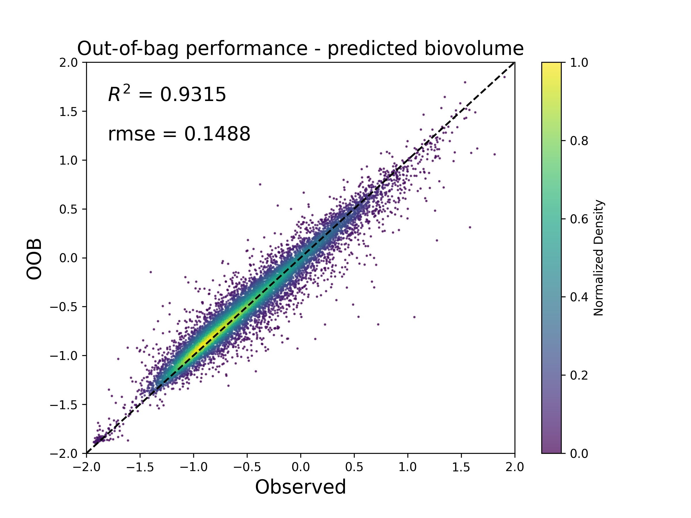
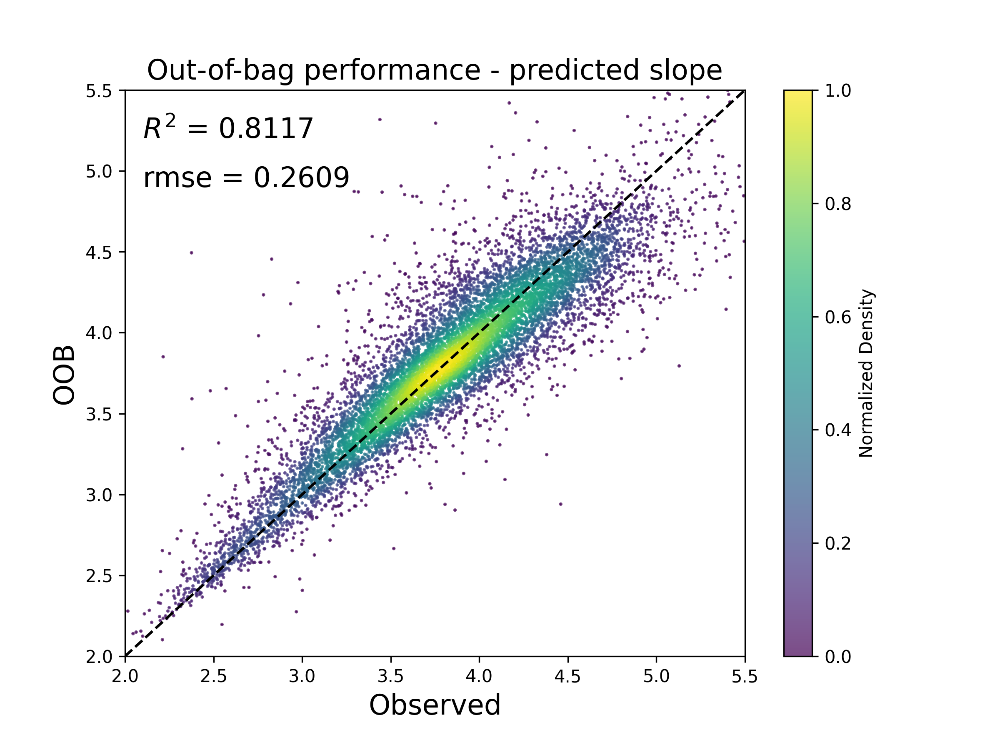

## Global reconstructions of particle size distribution from UVP5 observations using bagging random forest algorithm

I applied machine learning techniques to investigate global particle size distributions (PSDs) data. Briefly, I reconstructed the BioVolume and Slope data by applying a bagged Random Forest (RF) algorithm to a global data set of UVP5 (Underwater Vision Profiler) observations. Below is my report.

***

## Introduction 
Export of sinking particles from the surface ocean is critical for carbon sequestration and to provide energy to the deep biosphere. The magnitude and spatial patterns of this export have been estimated in the past by in situ particle flux observations, satellite-based algorithms, and ocean biogeochemical models; however, these estimates remain uncertain.

Here, I present an analysis of particle size distributions (PSDs) from a global compilation of in situ Underwater Vision Profiler 5 (UVP5) optical measurements. Using a machine learning algorithm, I extrapolate sparse UVP5 observations to the global ocean from well-sampled oceanographic variables. I reconstruct global maps of PSD parameters (biovolume [BV] and slope) for particles at the base of the euphotic zone. These reconstructions reveal consistent global patterns, with high chlorophyll regions generally characterized by high particle BV and flatter PSD slope, that is, a high relative abundance of large versus small particles.

The Random Forest (RF) algorithm is an example of supervised learning that employs labeled data to teach how to categorize unlabeled data. A RF deploys a decision tree learning scheme to solve a regression equation iteratively, and reports the ensemble average. Using a RF, each individual decision tree is trained on a subset of the available data, with a subset of predictors, but the power of the method emerges when considering the ensemble average. The RF is able to learn statistical relationships between target variables (here, UVP5-derived slope and BV) and a series of predictors (here, environmental variables), to make reconstructions that minimize the error between predicted and observed data. Because a RF is highly non-linear, it runs the risk of overfitting the data, producing solutions with low error, but also limited predictive power outside of the training data set. To mitigate the risk of overfitting, the RF does not use all data points for training. Instead, a bootstrapped sample (∼70%) of the data is selected for each tree in the forest. The skill of the final regression is determined by finding the error between the model and the data that was not used for training, that is, the so-called “out-of-bag” (OOB) data.

Therefore, the idea of using RF to extrapolate the PSD data is feasible. I use bagging RF algorithm to extrapolate the gridded PSD BV and slope at the euphotic zone and mixed layer depth horizons, based on monthly climatological predictors that include temperature, salinity, silicate, depth, shortwave radiation and other biogeochemical variables such as oxygen, nutrients, chlorophyll, mixed layer depth, net primary production (NPP), euphotic depth, and iron deposition. These predictors can make sure that the model captures both static and denamic aspects of PSD, improving the robustness and accuracy of the resulting reconstructions.

I concluded that ...


## Data

The original BioVolume and Slope data are from EcoPart, where the data are collecting by UVP5 from different cruises. The data set consists of over 6,700 profiles from 119 cruises, collected from 2008 to 2020. The UVP instrument captures images of particles within a control volume as it is lowered in the water column, providing counts of particles with sizes ranging from different diameters. The UVP quantifies the abundance of particulate matter into size classes (bins), allowing to determine PSD as a function of depth.


*Figure 1: Images of plankton collected by UVP5 (Kiko and Schröder, 2020)*

PSD is modeled as:

$$ n(s) = n_0 \times s^{-\beta} $$

where s is the equivalent spherical diameter or size of the particle (in units of 𝜇m), and n(s) is the abundance of particles (units of m-3 𝜇m-1) in a vanishingly small size interval [s, s + ds]. $$n_0$$ is the intercepth and $$\beta$$ is the slope. So Biovolume is given by:

$$ BV = \int_{s_{min}}^{s_{max}} n(s) \cdot \frac{\pi}{6} \cdot s^3 ds = \frac{\pi}{6} \cdot n_0 \cdot(\frac{s_{max}^{4-\beta}}{4-\beta} - \frac{s_{min}^{4-\beta}}{4-\beta}) $$

Therefore, with the Biovolume data and the slope data, we would be able to determine the intercept, thus revealing the particle distributions in the global ocean, and therefore do further research.

The PSDs data is binned on a regular 1° resolution global grid. Taking 100m depth (which is usually considered as a threshold for mixed layer or euphotic layer) as an example, the plots of seasonal mean of the original data are as follows: 


*Figure 2: The original BioVolume data. The data was preprocessed using log10, so -1 on the plot means a biovolume of 0.1 ppm, and 1 on the plot means a biovolume of 10 ppm.*


*Figure 3: The original Slope data. It is unitless.*

The predictors are collected from various datasets based on the choice in Clements et al. (2022):
<table>
  <tr>
    <th>Feature Category</th>
    <th>Feature</th>
    <th>Dimensions</th>
    <th>Sources</th>
  </tr>
  <tr>
    <td>Universal</td>
    <td>Temperature</td>
    <td>12 × 102 × 180 × 360 </td>
    <td>WOA 18</td>
  </tr>
  <tr>
    <td> </td>
    <td>Salinity</td>
    <td>12 × 102 × 180 × 360 </td>
    <td>WOA 18</td>
  </tr>
  <tr>
    <td> </td>
    <td>Silicate</td>
    <td>12 × 102 × 180 × 360 </td>
    <td>WOA 18</td>
  </tr>
  <tr>
    <td> </td>
    <td>Depth</td>
    <td>12 × 102 × 180 × 360 </td>
    <td>WOA 18</td>
  </tr>
  <tr>
    <td> </td>
    <td>Shortwave Radiation</td>
    <td>12 × 180 × 360 </td>
    <td>ERA 5</td>
  </tr>
  <tr>
    <td>Oxygen</td>
    <td>Oxygen</td>
    <td>12 × 102 × 180 × 360 </td>
    <td>WOA 18</td>
  </tr>
  <tr>
    <td> </td>
    <td>AOU</td>
    <td>12 × 102 × 180 × 360 </td>
    <td>WOA 18</td>
  </tr>
  <tr>
    <td>Nutrients</td>
    <td>Nitrate</td>
    <td>12 × 102 × 180 × 360 </td>
    <td>WOA 18</td>
  </tr>
  <tr>
    <td> </td>
    <td>Phosphate</td>
    <td>12 × 102 × 180 × 360 </td>
    <td>WOA 18</td>
  </tr>
  <tr>
    <td>CHL</td>
    <td>Merged Chlorophyll</td>
    <td>12 × 180 × 360 </td>
    <td>GlobColour</td>
  </tr>
  <tr>
    <td> </td>
    <td>Modis Chlorophyll</td>
    <td>12 × 180 × 360 </td>
    <td>NASA G.S.F.C.</td>
  </tr>
  <tr>
    <td>MLD</td>
    <td>Mixed Layer Depth I</td>
    <td>12 × 180 × 360 </td>
    <td>MIMOC</td>
  </tr>
  <tr>
    <td> </td>
    <td>Mixed Layer Depth II</td>
    <td>12 × 180 × 360 </td>
    <td> de Boyer Montegut et al. (2004) </td>
  </tr>
  <tr>
    <td>NPP</td>
    <td>Eppley VGPM</td>
    <td>12 × 180 × 360 </td>
    <td>Antoine and Morel (1996) </td>
  </tr>
  <tr>
    <td> </td>
    <td>VGPM</td>
    <td>12 × 180 × 360 </td>
    <td>Behrenfeld and Falkowski (1997) </td>
  </tr>
  <tr>
    <td> </td>
    <td>CBPM</td>
    <td>12 × 180 × 360 </td>
    <td>Westberry et al. (2008) </td>
  </tr>
  <tr>
    <td> </td>
    <td>CAFE</td>
    <td>12 × 180 × 360 </td>
    <td>Silsbe et al. (2016) </td>
  </tr>
  <tr>
    <td>Euphotic Depth </td>
    <td>Eppley VGPM Euphotic depth</td>
    <td>12 × 180 × 360 </td>
    <td>Morel et al. (2007) </td>
  </tr>
  <tr>
    <td> </td>
    <td>VGPM Euphotic depth</td>
    <td>12 × 180 × 360 </td>
    <td>Morel et al. (2007) </td>
  </tr>
  <tr>
    <td>  </td>
    <td>CBPM Euphotic depth</td>
    <td>12 × 180 × 360 </td>
    <td>Morel et al. (2007) </td>
  </tr>
  <tr>
    <td>Iron Deposition </td>
    <td>ELabile Fraction</td>
    <td>12 × 180 × 360 </td>
    <td>Myriokefalitakis et al. (2018) </td>
  </tr>
  <tr>
    <td> </td>
    <td>Soluble Fraction</td>
    <td>12 × 180 × 360 </td>
    <td>Hamilton et al. (2019) </td>
  </tr>
</table>

For temperature, salinity, silicate, oxygen, and nutrients, we will also consider both their temporal and vertical changes as parts of predictors; for shortwave radiation, chlorophyll, NPP, mixed layer depth, euphotic depth, and iron deposition, which remain the same at different depth, just consider their temporal changes.

(Link to datasets)

## Modelling

The algorithm applied in this project is based on Bagging Random Forest Regression, which is a combination of the Random Forest (RF) ensemble learning method and the Bagging (Bootstrap Aggregating) technique.

RF is an ensemble of decision trees, where each tree is trained on a different random subset of the data, and predictions are made by averaging the predictions of all the tress. Then main idea is that combining multiple models (trees) improves generalization by reducing overfitting. Bagging is a technique where each tree is trained on a random subset of the data. These subsets are created by bootstrapping, i.e. sampling with replacement from the original dataset. Some data points are included multiple times, while others are left out. The key concept is that the data points left out in each subset can be used to estimate the model's generalization error, i.e. how well it might perform on unseen data.

One of the key features of Bagging RF is the ability to evaluate the model using in-bag and out-of-bag (OOB) predictions. In-bag predictions are predictions made on the same data points that were used to train each individual decision tree, i.e. the data points that were sampled in the bootstrapped subset. Each tree is trained on a different subset of the data, leaving out about one-third of the data. The data points that were left out in each bootstrapped sample are used to make OOB predictions, effectively serving as a validation set. This is especially useful for assessing model performance without needing a separate validation dataset.

For both the in-bag and out-of-bag predictions, the $$R^2$$ and RMSE metrics are calculated using the r2rmse() function.

```python
from sklearn.ensemble import RandomForestRegressor

# RandomForestRegressor

model = RandomForestRegressor(random_state=0, oob_score=True)

pred_bv = []
pred_sp = []

preds = np.column_stack((predictors_ddepth.flatten(),
                         predictors_temp.flatten(),predictors_temp_ddd.flatten(),predictors_temp_ddt.flatten(),
                         predictors_salt.flatten(),predictors_salt_ddd.flatten(),predictors_salt_ddt.flatten(),
                         predictors_si.flatten(),predictors_si_ddd.flatten(),predictors_si_ddt.flatten(),
                         predictors_shwv.flatten(),predictors_shwv_ddt.flatten(),
                         predictors_oxy.flatten(),predictors_oxy_ddd.flatten(),predictors_oxy_ddt.flatten(),
                         predictors_nut.flatten(),predictors_nut_ddd.flatten(),predictors_nut_ddt.flatten(),
                         predictors_chl.flatten(),predictors_chl_ddt.flatten(),
                         predictors_npp.flatten(),predictors_npp_ddt.flatten(),
                         predictors_mld.flatten(),predictors_mld_ddt.flatten(),
                         predictors_irn.flatten(),predictors_irn_ddt.flatten(),
                         predictors_zeu.flatten(),predictors_zeu_ddt.flatten(),))

x = preds
X = preds
y = np.column_stack((biov_data.flatten(), slope_data.flatten()))

# Remove rows with NaN values
idrem = np.unique(np.concatenate([np.where(np.isnan(np.mean(y, axis=1)))[0], np.where(np.isnan(np.mean(x, axis=1)))[0]]))
x = np.delete(x, idrem, axis=0)
y = np.delete(y, idrem, axis=0)

model.fit(x, y)

yhat = model.predict(x)
y_oob = model.oob_prediction_

def r2rmse(y_pred, y_true):
    r2 = r2_score(y_true, y_pred)
    rmse = np.sqrt(mean_squared_error(y_true, y_pred))
    return {'r2': r2, 'rmse': rmse}


mask = np.mean(X, axis=1)
mask[~np.isnan(mask)] = 1
mask[np.isnan(mask)] = 0

X[np.isnan(X)] = 0
y_recon = model.predict(X)
y_recon = y_recon * mask[:, np.newaxis]

# Calculate R2 and RMSE for both biological variable and slope predictions
pred_bv.append({
    'oobPred_bv': y_oob[:, 0],
    'inBagPred_bv': yhat[:, 0],
    'keep_data_bv': y[:, 0],
    'oobStats': r2rmse(y_oob[:, 0], y[:, 0]),
    'inBagStats': r2rmse(yhat[:, 0], y[:, 0]),
    'recon':y_recon[:, 0].reshape(12,102,180,360)
})

pred_sp.append({
    'oobPred': y_oob[:, 1],
    'inBagPred': yhat[:, 1],
    'keep_data': y[:, 1],
    'oobStats': r2rmse(y_oob[:, 1], y[:, 1]),
    'inBagStats': r2rmse(yhat[:, 1], y[:, 1]),
    'recon':y_recon[:, 1].reshape(12,102,180,360)
})

# Apply topographic mask
pred_bv *= tp_msk
pred_sp *= tp_msk
```

## Results

The reconstructed seasonal mean BioVolume and Slope data at 100m depth are as follows:
(Figure X shows... [description of Figure X].)


*Figure 4: The reconstructed BioVolume data. The data was preprocessed using log10, so -1 on the plot means a biovolume of 0.1 ppm, and 1 on the plot means a biovolume of 10 ppm. The scattered dots are orginal biovolume data.*


*Figure 5: The reconstructed Slope data. It is unitless. The scattered dots are orginal slope data.*

Figure 4 and 5 show the global reconstructions of PSD BV and slope. The reconstruction method is able to capture most of the variability of the UVP5 observations, and robustly reproduce the gridded measurements, with global average values of 0.34 ppm for BV (r2 = 0.99) and 3.8 for slope (r2 = 0.97) when considering the entire data set.

The reconstructions of the PSD for the time frame 2008 to 2020, reveal high BV in productive regions such as high latitudes, coastal waters, and upwelling systems, and low BV in the oligotrophic subtropical gyres. PSD slopes show a nearly opposite pattern, with smaller slopes (i.e., “flatter” PSD) in more productive regions, and larger slopes in oligotrophic waters.

## Discussion

In section "Modeling", it is discussed that the benefit of bagging random forest algorithm is that we can use the left-out data points in each bootstrapped sample to make OOB predictions. The OOB predictions can effectively serve as a validation set, so we can assess model performance without needing a separate validation dataset.


*Figure 6: Performance of the Random Forest reconstruction shown as density scatter plots of predicted versus observed BV (colors indicate the normalized density of observations at each point).*



*Figure 7: Same as figure 6, but using out-of-bag (OOB) predictions, that is, predictions versus observations withheld from training.*


*Figure 8: Performance of the Random Forest reconstruction shown as density scatter plots of predicted versus observed particulate slope (colors indicate the normalized density of observations at each point).*



*Figure 9: Same as figure 8,but using out-of-bag (OOB) predictions, that is, predictions versus observations withheld from training.*

As shown in Figure 7 and 9, these OOB observations are also robustly predicted, with a r2 of 0.93 for BV and 0.81 for slope.

## Conclusion

(Here is a brief summary. From this work, the following conclusions can be made:)
* first conclusion
* second conclusion

(Here is how this work could be developed further in a future project.)

In future projects, there are several possible research topics of work that can be developed:

First, I would further do research into the main predictors and decide which predictors are the most important factors that affect particle size distributions. 

Second, it would be greatly helpful to look at the data of different regions. By dividing the data into South or North Indian Ocean, South or North Tropical Pacific, South or North Tropical Atlantic, and so on, will help better understand different particle features in different regions. From this, we can potentially tell the features like nutrients, carbon flux and so on in different regions as well.

Third, since the data is monthly mean data, we can further look at the seasonal change of the reconstructed data.

Fourth, I mainly focus on the euphotic zone and mixed layer depth data. In the future, I will look deeper into mesopelagic zone and other deeper regions.

## References
[1] Clements, D. J., et al. "Constraining the particle size distribution of large marine particles in the global ocean with in situ optical observations and supervised learning." Global Biogeochemical Cycles 36.5 (2022): e2021GB007276.

[2] Clements, D. J., et al. "New estimate of organic carbon export from optical measurements reveals the role of particle size distribution and export horizon." Global Biogeochemical Cycles 37.3 (2023): e2022GB007633.

[3] Picheral, Marc, et al. "The Underwater Vision Profiler 5: An advanced instrument for high spatial resolution studies of particle size spectra and zooplankton." Limnology and Oceanography: Methods 8.9 (2010): 462-473.

[4] Kiko, Rainer, et al. "A global marine particle size distribution dataset obtained with the Underwater Vision Profiler 5." Earth System Science Data Discussions 2022 (2022): 1-37.

[5] Guidi, Lionel, et al. "Relationship between particle size distribution and flux in the mesopelagic zone." Deep Sea Research Part I: Oceanographic Research Papers 55.10 (2008): 1364-1374.


### Code

A link to your code must be submitted on BruinLearn, and the course instructor must be able to download your code to mark it. The code could be in a Google Colab notebook (make sure to *share* the notebook so access is set to **Anyone with the link**), or you could upload the code into a separate GitHub repository, or you could upload the code into the `assets` directory of your website and link to it. 

[back](./)
