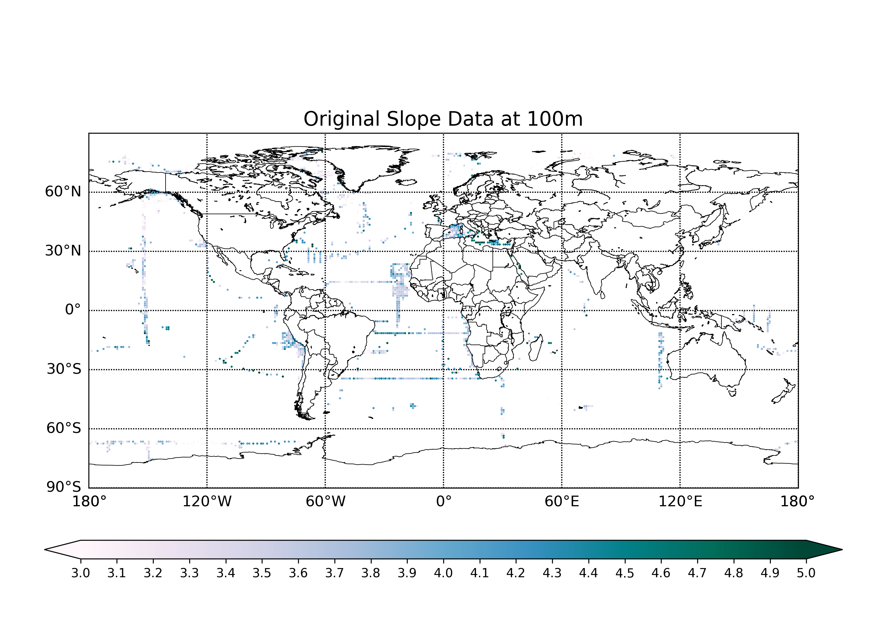
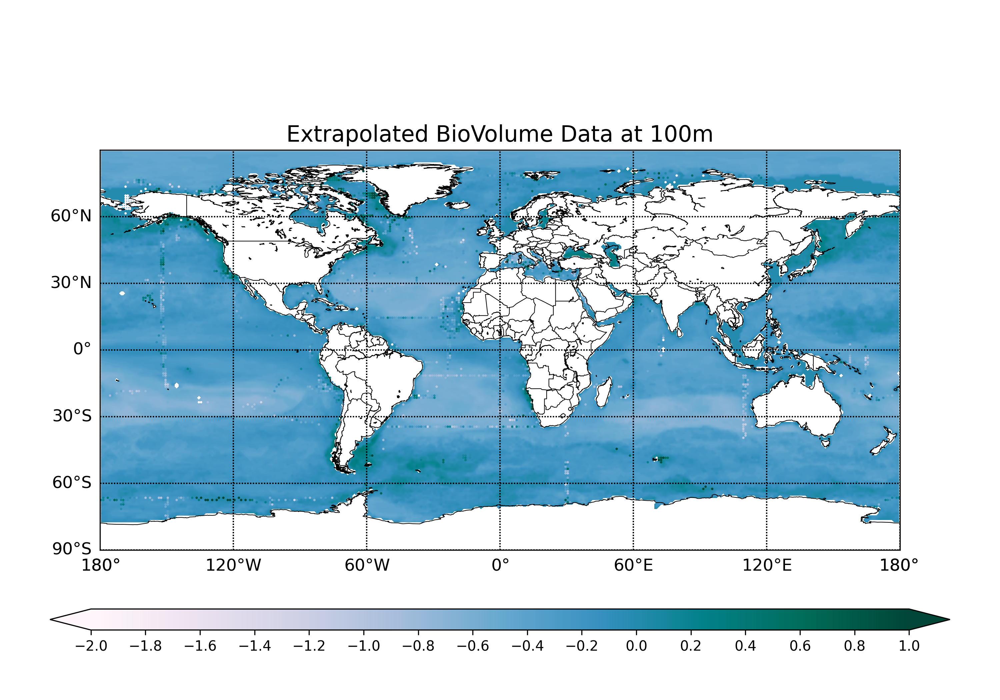
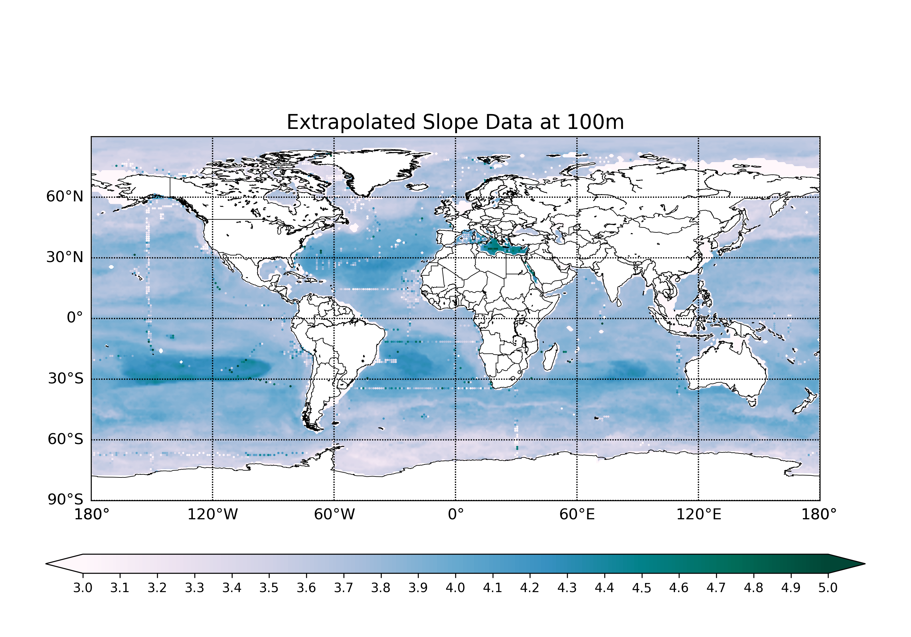

## My Project

I applied machine learning techniques to investigate global particle size distributions (PSDs). Briefly, I reconstructed the global PSDs data by applying a bagged Random Forest (RF) algorithm to a global data set of UVP5 (Underwater Vision Profiler) observations.

Below is my report.

***

## Introduction 
Export of sinking particles from the surface ocean is critical for carbon sequestration and to provide energy to the deep biosphere. The magnitude and spatial patterns of this export have been estimated in the past by in situ particle flux observations, satellite-based algorithms, and ocean biogeochemical models; however, these estimates remain uncertain.

Here, I present an analysis of particle size distributions (PSDs) from a global compilation of in situ Underwater Vision Profiler 5 (UVP5) optical measurements. Using a machine learning algorithm, I extrapolate sparse UVP5 observations to the global ocean from well-sampled oceanographic variables. I reconstruct global maps of PSD parameters (biovolume [BV] and slope) for particles at the base of the euphotic zone. These reconstructions reveal consistent global patterns, with high chlorophyll regions generally characterized by high particle BV and flatter PSD slope, that is, a high relative abundance of large versus small particles.

The Random Forest (RF) algorithm is an example of supervised learning that employs labeled data to teach how to categorize unlabeled data. A RF deploys a decision tree learning scheme to solve a regression equation iteratively, and reports the ensemble average. Using a RF, each individual decision tree is trained on a subset of the available data, with a subset of predictors, but the power of the method emerges when considering the ensemble average. The RF is able to learn statistical relationships between target variables (here, UVP5-derived slope and BV) and a series of predictors (here, environmental variables), to make reconstructions that minimize the error between predicted and observed data. Because a RF is highly non-linear, it runs the risk of overfitting the data, producing solutions with low error, but also limited predictive power outside of the training data set. To mitigate the risk of overfitting, the RF does not use all data points for training. Instead, a bootstrapped sample (∼70%) of the data is selected for each tree in the forest. The skill of the final regression is determined by finding the error between the model and the data that was not used for training, that is, the so-called “out-of-bag” (OOB) data.

Therefore, the idea of using RF to extrapolate the PSD data is feasible. I use bagged RF algorithm to extrapolate the gridded PSD BV and slope at the euphotic zone and mixed layer depth horizons, based on monthly climatological predictors that include temperature, salinity, silicate, depth, shortwave radiation and other biogeochemical variables such as oxygen, nutrients, chlorophyll, mixed layer depth, net primary production (NPP), euphotic depth, and iron deposition. These predictors can make sure that the model captures both static and denamic aspects of PSD, improving the robustness adn accuracy of the resulting reconstructions.

I concluded that ...


## Data

(Here is an overview of the dataset, how it was obtained and the preprocessing steps taken, with some plots!)

The original BioVolume and Slope data are from EcoPart, where the data are collecting by UVP5 from different cruises. The data is binned on a regular 1° resolution global grid. Taking 100m depth (which is usually considered as a threshold for mixed layer or euphotic layer) as an example, the plots of seasonal mean of the original data are as follows: 


*Figure 1: The original BioVolume data. The data was preprocessed using log10, so -1 on the plot means a biovolume of 0.1, and 1 on the plot means a biovolume of 10.*




*Figure 2: The original Slope data. It is unitless.*

The predictors are collected from various datasets:
<table>
  <tr>
    <th>Feature Category</th>
    <th>Feature</th>
    <th>Dimensions</th>
    <th>Sources</th>
  </tr>
  <tr>
    <td>Universal</td>
    <td>Temperature</td>
    <td>12 $\times$ 102 $\times$ 180 $\times$ 360 </td>
    <td>WOA 18</td>
  </tr>
  <tr>
    <td> </td>
    <td>Salinity</td>
    <td>12 $\times$ 102 $\times$ 180 $\times$ 360 </td>
    <td>WOA 18</td>
  </tr>
  <tr>
    <td> </td>
    <td>Silicate</td>
    <td>12 $\times$ 102 $\times$ 180 $\times$ 360 </td>
    <td>WOA 18</td>
  </tr>
  <tr>
    <td> </td>
    <td>Depth</td>
    <td>12 $\times$ 102 $\times$ 180 $\times$ 360 </td>
    <td>WOA 18</td>
  </tr>
  <tr>
    <td> </td>
    <td>Shortwave Radiation</td>
    <td>12 $\times$ 180 $\times$ 360 </td>
    <td>ERA 5</td>
  </tr>
  <tr>
    <td>Oxygen</td>
    <td>Oxygen</td>
    <td>12 $\times$ 102 $\times$ 180 $\times$ 360 </td>
    <td>WOA 18</td>
  </tr>
  <tr>
    <td> </td>
    <td>AOU</td>
    <td>12 $\times$ 102 $\times$ 180 $\times$ 360 </td>
    <td>WOA 18</td>
  </tr>
  <tr>
    <td>Nutrients</td>
    <td>Nitrate</td>
    <td>12 $\times$ 102 $\times$ 180 $\times$ 360 </td>
    <td>WOA 18</td>
  </tr>
  <tr>
    <td> </td>
    <td>Phosphate</td>
    <td>12 $\times$ 102 $\times$ 180 $\times$ 360 </td>
    <td>WOA 18</td>
  </tr>
  <tr>
    <td>CHL</td>
    <td>Merged Chlorophyll</td>
    <td>12 $\times$ 180 $\times$ 360 </td>
    <td>GlobColour</td>
  </tr>
  <tr>
    <td> </td>
    <td>Modis Chlorophyll</td>
    <td>12 $\times$ 180 $\times$ 360 </td>
    <td>NASA G.S.F.C.</td>
  </tr>
  <tr>
    <td>MLD</td>
    <td>Mixed Layer Depth I</td>
    <td>12 $\times$ 180 $\times$ 360 </td>
    <td>MIMOC</td>
  </tr>
  <tr>
    <td> </td>
    <td>Mixed Layer Depth II</td>
    <td>12 $\times$ 180 $\times$ 360 </td>
    <td> de Boyer Montegut et al. (2004) </td>
  </tr>
  <tr>
    <td>NPP</td>
    <td>Eppley VGPM</td>
    <td>12 $\times$ 180 $\times$ 360 </td>
    <td>Antoine and Morel (1996) </td>
  </tr>
  <tr>
    <td> </td>
    <td>VGPM</td>
    <td>12 $\times$ 180 $\times$ 360 </td>
    <td>Behrenfeld and Falkowski (1997) </td>
  </tr>
  <tr>
    <td> </td>
    <td>CBPM</td>
    <td>12 $\times$ 180 $\times$ 360 </td>
    <td>Westberry et al. (2008) </td>
  </tr>
  <tr>
    <td> </td>
    <td>CAFE</td>
    <td>12 $\times$ 180 $\times$ 360 </td>
    <td>Silsbe et al. (2016) </td>
  </tr>
  <tr>
    <td>Euphotic Depth </td>
    <td>Eppley VGPM Euphotic depth</td>
    <td>12 $\times$ 180 $\times$ 360 </td>
    <td>Morel et al. (2007) </td>
  </tr>
  <tr>
    <td> </td>
    <td>VGPM Euphotic depth</td>
    <td>12 $\times$ 180 $\times$ 360 </td>
    <td>Morel et al. (2007) </td>
  </tr>
  <tr>
    <td>  </td>
    <td>CBPM Euphotic depth</td>
    <td>12 $\times$ 180 $\times$ 360 </td>
    <td>Morel et al. (2007) </td>
  </tr>
  <tr>
    <td>Iron Deposition </td>
    <td>ELabile Fraction</td>
    <td>12 $\times$ 180 $\times$ 360 </td>
    <td>Myriokefalitakis et al. (2018) </td>
  </tr>
  <tr>
    <td> </td>
    <td>Soluble Fraction</td>
    <td>12 $\times$ 180 $\times$ 360 </td>
    <td>Hamilton et al. (2019) </td>
  </tr>
</table>

For temperature, salinity, silicate, oxygen, and nutrients, we will also consider both their temporal and vertical changes as parts of predictors; for shortwave radiation, chlorophyll, NPP, mixed layer depth, euphotic depth, and iron deposition, which remain the same at different depth, just consider their temporal changes.


## Modelling

(Here are some more details about the machine learning approach, and why this was deemed appropriate for the dataset. )

(The model might involve optimizing some quantity. You can include snippets of code if it is helpful to explain things.)


The algorithm applied in this project is based on Bagging Random Forest Regression, which is a combination of the Random Forest (RF) ensemble learning method and the Bagging (Bootstrap Aggregating) technique.

RF is an ensemble of decision trees, where each tree is trained on a different random subset of the data, and predictions are made by averaging the predictions of all the tress. Then main idea is that combining multiple models (trees) improves generalization by reducing overfitting. Bagging is a technique where each tree is trained on a random subset of the data. These subsets are created by bootstrapping, i.e. sampling with replacement from the original dataset. Some data points are included multiple times, while others are left out. The key concept is that the data points left out in each subset can be used to estimate the model's generalization error, i.e. how well it might perform on unseen data.

One of the key features of Bagging RF is the ability to evaluate the model using in-bag and **out-of-bag (OOB)** predictions. In-bag predictions are predictions made on the same data points that were used to train each individual decision tree, i.e. the data points that were sampled in the bootstrapped subset. Each tree is trained on a different subset of the data, leaving out about one-third of the data. The data points that were left out in each bootstrapped sample are used to make OOB predictions, effectively serving as a validation set. This is especially useful for assessing model performance without needing a separate validation dataset.

For both the in-bag and out-of-bag predictions, the **$R^2$** and **RMSE** metrics are calculated using the r2rmse() function.


```python
from sklearn.ensemble import RandomForestRegressor

# RandomForestRegressor

model = RandomForestRegressor(random_state=0, oob_score=True)

pred_bv = []
pred_sp = []

preds = np.column_stack((predictors_ddepth.flatten(),
                         predictors_temp.flatten(),predictors_temp_ddd.flatten(),predictors_temp_ddt.flatten(),
                         predictors_salt.flatten(),predictors_salt_ddd.flatten(),predictors_salt_ddt.flatten(),
                         predictors_si.flatten(),predictors_si_ddd.flatten(),predictors_si_ddt.flatten(),
                         predictors_shwv.flatten(),predictors_shwv_ddt.flatten(),
                         predictors_oxy.flatten(),predictors_oxy_ddd.flatten(),predictors_oxy_ddt.flatten(),
                         predictors_nut.flatten(),predictors_nut_ddd.flatten(),predictors_nut_ddt.flatten(),
                         predictors_chl.flatten(),predictors_chl_ddt.flatten(),
                         predictors_npp.flatten(),predictors_npp_ddt.flatten(),
                         predictors_mld.flatten(),predictors_mld_ddt.flatten(),
                         predictors_irn.flatten(),predictors_irn_ddt.flatten(),
                         predictors_zeu.flatten(),predictors_zeu_ddt.flatten(),))

x = preds
X = preds
y = np.column_stack((biov_data.flatten(), slope_data.flatten()))

# Remove rows with NaN values
idrem = np.unique(np.concatenate([np.where(np.isnan(np.mean(y, axis=1)))[0], np.where(np.isnan(np.mean(x, axis=1)))[0]]))
x = np.delete(x, idrem, axis=0)
y = np.delete(y, idrem, axis=0)

model.fit(x, y)

yhat = model.predict(x)
y_oob = model.oob_prediction_

mask = np.mean(X, axis=1)
mask[~np.isnan(mask)] = 1
mask[np.isnan(mask)] = 0

X[np.isnan(X)] = 0
y_recon = model.predict(X)
y_recon = y_recon * mask[:, np.newaxis]

# Reshape for geographical grid

pred_bv = y_recon[:, 0].reshape(12,102,180,360)
pred_sp = y_recon[:, 1].reshape(12,102,180,360)

# Apply topographic mask
pred_bv *= tp_msk
pred_sp *= tp_msk
```

(This is how the method was developed.)

## Results

The reconstructed seasonal mean BioVolume and Slope data at 100m depth are as follows:
(Figure X shows... [description of Figure X].)



*Figure 3: The reconstructed BioVolume data. The data was preprocessed using log10, so -1 on the plot means a biovolume of 0.1, and 1 on the plot means a biovolume of 10.*




*Figure 4: The reconstructed Slope data. It is unitless.*


## Discussion

(From Figure X, one can see that... [interpretation of Figure X].)


## Conclusion

(Here is a brief summary. From this work, the following conclusions can be made:)
* first conclusion
* second conclusion

(Here is how this work could be developed further in a future project.)

## References
[1] DALL-E 3

[back](./)

